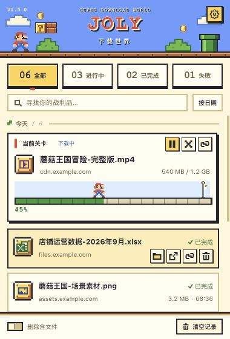
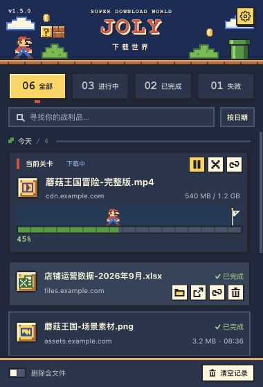
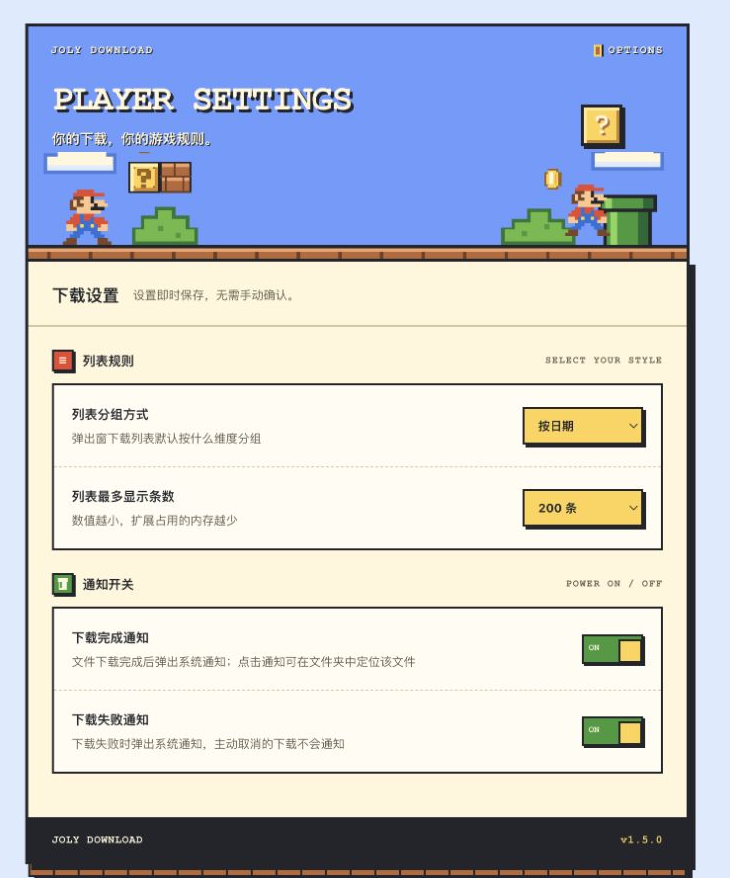
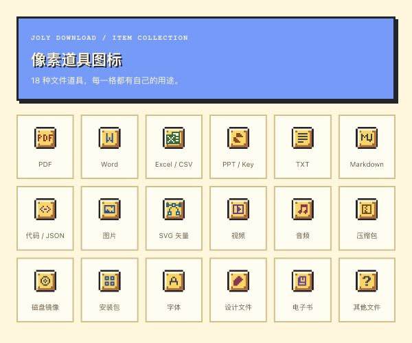

# Joly 下载 · Joly Download

<p align="center">
  
  
</p>

用点击工具栏图标弹出的面板查看和管理下载。**低内存是硬约束**：面板关闭即销毁，不向网页注入脚本，空闲时无常驻轮询。

| | |
|---|---|
| 扩展名 | **Joly 下载** |
| 英文名 / 仓库名 | **Joly Download**（`joly-download`） |
| 当前版本 | **v1.5.0** · 超级玛丽主题、关卡进度与像素图标；面板与设置页的版本号直接读取 `manifest.json` |
| 权限 | `downloads` / `downloads.open` / `downloads.ui` / `storage` / `notifications` |
| 仓库 | [JolyI/joly-download](https://github.com/JolyI/joly-download) |

个人项目，通过开发者模式加载，未上架 Chrome 应用商店。不联网、不上传任何数据、不向任何网页注入脚本。

## 安装

需要 **Chrome 116 或更高版本**。

1. 下载 [v1.5.0 安装包 `joly-download-v1.5.0.zip`](https://github.com/JolyI/joly-download/releases/download/v1.5.0/joly-download-v1.5.0.zip)，解压到准备长期保留的目录
2. 打开 `chrome://extensions`，右上角开启「开发者模式」
3. 点「加载已解压的扩展程序」，选择解压后**包含 `manifest.json` 的目录**
4. 点击工具栏上的扩展图标 → 弹出下载面板

已有旧版时，将新版本文件覆盖到原加载目录，再到 `chrome://extensions` 点击扩展卡片上的「重新加载」。
保持加载路径不变可沿用原扩展 ID 与设置。

开发时也可以直接加载仓库根目录：

```bash
git clone https://github.com/JolyI/joly-download.git
```

版本详情见 [v1.5.0 发布说明](docs/release-v1.5.0.md) 与 [更新日志](CHANGELOG.md)。

## 功能

### 面板
- 点击工具栏图标弹出面板（380 x 560）；关闭即销毁面板页面
- 注意：弹出窗在点击页面其它位置时会自动关闭，这是浏览器行为；需要长期挂着看进度请用浏览器窗口右侧的侧边栏方案（可改回）
- 跟随系统深色 / 浅色
- **三行分区布局**，信息各归其位，不会互相挤占宽度：

      文件名（过长截断）                    状态（右侧固定，永不截断）
      来源站点（过长截断）            大小 · 时间（右侧固定）
      ▓▓▓▓▓░░░░ 45%  3.2 MB/s  剩余 12 秒   （仅下载中/已暂停）

- **当前关卡**突出第一条进行中、已暂停或安全扫描的任务，操作按钮直接显示在卡片右上角
- 其余条目的操作按钮在鼠标悬浮或键盘聚焦时显示，以像素图标呈现，文件名保留整行阅读空间
- 按日期分组时，行内只显示时刻，不重复分组头已表达的日期
- 状态筛选：全部 / 进行中 / 已完成 / 失败，每项显示已加载记录中的数量；搜索不会改变这些总数
- 搜索：按文件名或来源站点实时过滤
- 分组：按日期（今天 / 昨天 / 具体日期）或按类型（图片 / 视频 / 音频 / 文档 / 压缩包 / 安装包 / 其他），点右上角按钮循环切换，也可设为不分组
- 分组头吸顶，并显示该组条数

### 每个下载条目
- ⭐ 打开所在文件夹：在访达 / 资源管理器中直接定位该文件
- 打开文件：用系统默认应用打开
- 暂停 / 继续：Chrome 原生支持断点续传
- 取消下载
- 重新下载：对失败或被取消的任务，按原链接重新发起
- 复制下载链接
- 删除（**是否连磁盘文件一起删，由面板底部开关决定**）

按状态自动显示对应的按钮，不需要的按钮不会出现在 DOM 里。

### 底部「删除含文件」开关（重要）

面板底部工具栏有一个开关：

    删除含文件  [ ○──]

它决定点垃圾桶时**要不要连磁盘文件一起删**：

| 开关 | 点垃圾桶的效果 | 可恢复 |
|---|---|---|
| 关（默认） | 只从下载历史里移除条目，**磁盘文件原封不动** | — |
| 开 | 删除磁盘文件 **+** 移除记录 | ❌ **不进废纸篓，不可恢复** |

开启时有三处视觉提示，防止"忘了还开着"就误删文件：

- 开关变红、文字变红加粗
- 行内垃圾桶换成**带 × 的图标**，并始终显示红色
- 悬停提示变成「删除（含磁盘文件，不进废纸篓）」

删完后弹一条**红色**提示（停留 4.2 秒）：

    已删除「报表.xlsx」及磁盘文件

- 开关状态会被记住（存在 storage.local）
- 底部的「清空记录」按钮**永远只删已完成记录**，不受这个开关影响
- 文件已不在磁盘上时，记录照样删掉，提示会写明"磁盘文件未删除或已不存在"

> 不常删文件的话建议保持关闭——想清磁盘时用「打开所在文件夹」→ 在访达里删，走废纸篓可撤销。

### 实时进度
- 当前关卡以像素角色跑向终点旗帜表示进度，其余任务保留像素进度条
- 进度条 + 百分比
- 下载速度（EMA 平滑）
- 剩余时间
- 已下载 / 总大小

### 工具栏角标
- 有「进行中」的下载时，工具栏图标右上角显示**红色数字角标**（白字）
- 下载全部结束后角标自动消失；只统计正在下载的任务（暂停的不算）
- 角标由下载事件驱动更新，空闲时不产生任何开销
- 浏览器启动时会重算一次，不会残留上次的旧角标

### 系统通知
- 下载完成 / 下载失败时弹出系统通知（可在设置里分别关闭）
- 同时完成多个文件时合并为一条通知，不会刷屏
- 点击「下载完成」通知 → 直接在访达中定位该文件
- 自己主动取消的下载不会弹出失败通知

### 设置页
点面板右上角齿轮图标进入像素游戏风格的设置面板，设置即时保存：
- 列表分组方式
- 列表最多显示条数（100 / 200 / 500，越小内存越低）
- 下载完成通知 / 下载失败通知 开关

## 关于「接管原生下载界面」（已移除）

早期版本有个「接管原生下载界面」开关，它调用
chrome.downloads.setUiOptions({ enabled: false }) 隐藏 Chrome 自带的下载气泡。

**该功能已被移除**，原因是一个绕不过去的副作用：

> 关掉原生 UI 后，Chrome 就没有地方弹出安全下载的「保留」确认框了。
> 被 Safe Browsing 标记的文件会**静默卡在 100%**：不报错、不完成，
> 而且 Chrome 不会给它打上危险标记（danger 仍是 safe），
> 所以客户端连"代你点保留"都做不到（acceptDanger 会被拒绝）。

实测对照：同一个文件，开启接管时永久卡在 100%；关闭接管后 Chrome 弹出「保留」，点一下即可完成。

扩展启动时会读一次旧开关，若你曾开启过，会**自动帮你把原生界面复原**。
manifest.json 里的 "downloads.ui" 权限目前**只为这段一次性迁移保留**，后续版本可以移除。

## 视觉主题

v1.5.0 使用**超级玛丽主题**：天空、云朵、山丘、管道与砖块组成顶部场景，
金色道具格、像素边框和按钮按压反馈贯穿面板；深色模式换成夜间配色。
面板仍保持 380 × 560，下载状态、文件名和操作都有明确位置。

- **扩展图标**：红帽与金色 J 字母组合，提供 16 / 32 / 48 / 128 像素版本。
- **计数筛选**：全部、进行中、已完成、失败各显示数量，选中项使用金色道具块样式。
- **当前关卡**：优先展示第一条进行中、已暂停或安全扫描的任务，常用操作直接可见。
  角色位置与进度条共用 `--p`，随下载进度向终点旗帜移动。
- **完成反馈**：任务刚完成时弹出一次金币；载入已完成的历史记录时不会播放。
  角色移动与金币动效尊重系统减少动态效果设置。
- **空状态**：问号砖块与像素角色；没有记录和没有搜索结果时分别给出提示。
- **底部工具栏**：「删除含文件」开关与「清空记录」集中在底部，保留危险操作提示。
- **设置页**：场景顶部与分区控制面板，按列表规则、通知开关组织设置，适配窄窗口。

<p align="center">
  
</p>

### 文件图标

每个文件使用 **32 像素的金色道具格与像素符号**，以形状和配色区分格式。
XLSX 等表格使用绿色「X＋表格」图标，SVG 等矢量文件使用像素矢量节点。
文件夹、打开、暂停、继续、复制链接、删除等条目操作也统一为实心像素图标。

<p align="center">
  
</p>

共 18 类：PDF、Word、表格、演示文稿、纯文本、Markdown、代码、图片、矢量图、视频、音频、
压缩包、磁盘镜像、安装包、字体、设计文件、电子书和其他文件。
图标按文件扩展名识别，支持大小写；未知格式与无扩展名文件使用通用图标。

图标细分独立于原来的七种列表分组，分组与排序规则保持一致。
进度变化会复用现有图标节点，文件扩展名变化后才按需替换。

### 改 UI 不用反复重载扩展

在仓库根目录启动本地 HTTP 服务：

```bash
python3 -m http.server 8765 --bind 127.0.0.1
```

打开 [交互预览](http://127.0.0.1:8765/tools/preview-live.html)。它加载实际的
`popup.html`、`popup.css` 和 `popup.js`，用内存模拟 Chrome 下载 API，支持筛选、搜索、
分组与行内操作。旁边的四个控制按钮可推进下载 10%、完成首个进行中下载、清空模拟记录，
或恢复初始 6 条记录。文件、网络下载和剪贴板操作均已替换为模拟行为。
添加 `?panel=1` 可只显示 380 × 560 面板，便于截图。

仓库也保留不执行下载逻辑的静态预览，直接复用正式页面样式与 SVG 图标：

- `tools/preview.html` —— 列表，覆盖下载中 / 已完成 / 已拦截 / 已暂停 / 失败各种状态
- `tools/preview-idle.html` —— 没有进行中的下载时
- `tools/preview-empty.html` —— 问号砖块与角色空状态
- `tools/preview-file-icons.html` —— 18 类文件图标

开发检查无需安装第三方依赖，在仓库根目录运行：

```bash
node --check popup.js
node --check background.js
node --check options.js
node --check tools/preview-mock.js
node tools/check-file-icons.cjs
```

图标检查覆盖扩展名映射、大小写与通用回退、原分组兼容、同组改名，以及进度更新时的节点复用。
预览用于检查布局、亮暗主题和模拟交互；真实下载、系统通知、文件操作和进程内存需在加载扩展后验证。

## 性能约定（硬约束）

这是一条不可退让的约束：**必须极低内存占用**。具体做法：

- **零 content script**：不向任何网页注入代码，内存不随标签页数量增长
- **无空闲轮询**：空闲时不保留周期性刷新；通知合并、角标防抖和提示使用短时的一次性定时器
- **周期性刷新是条件化的**：仅当存在「进行中」的下载时，才启动一个 1s 的兜底刷新
  （用于保证速度与进度显示流畅），全部结束后立即 clearInterval
- **事件驱动为主**：进度靠 chrome.downloads.onChanged 原地更新受影响的那一行
- **增量渲染**：keyed 复用行节点，切换筛选/搜索不会整表重建，行被移除时同步从索引中删除以保证可被 GC 回收
- **列表硬上限**：默认 200 条，可在设置页调低到 100 条进一步省内存
- **按钮按需创建**：只创建当前状态需要的操作；当前关卡立即创建，其余条目在悬浮或聚焦时创建
- **零第三方库**，纯原生 JS
- **面板关闭即销毁页面**，页面销毁前清理定时器；后台 Service Worker 由浏览器按事件唤醒和休眠

### 验收方法

Chrome 菜单 → 更多工具 → 任务管理器（Shift+Esc），观察扩展进程内存：

| 场景 | 目标 |
|---|---|
| 面板关闭 | 不驻留，约等于 0 |
| 面板打开、空闲 | 小于 15 MB |
| 面板打开、有下载进行中 | 小于 30 MB |

打开面板静置 1 分钟，内存不应持续增长。
以上数值是性能验收目标；v1.5.0 未重新实测进程内存，不将模拟预览或脚本检查作为内存验收结果。

## 文件结构

    manifest.json        扩展清单（MV3，无 content_scripts）
    background.js        Service Worker：下载事件、工具栏角标、系统通知与设置变更
    popup.html           弹出窗结构 + SVG 图标精灵
    popup.css            超级玛丽主题：关卡布局 / 角色进度 / 像素交互 / 深色模式
    popup.js             弹出窗逻辑：分组视图 + 增量渲染 + 事件驱动更新
    options.html         设置页（同一套主题）
    options.js           设置页逻辑（只读写少量设置项）
    icons/               红帽 J 字母扩展图标
    assets/              场景、角色与旗帜 SVG
    docs/mario-panel.png       当前面板浅色预览图
    docs/mario-panel-dark.png  当前面板深色预览图
    docs/mario-settings.png    设置页预览图
    docs/file-icons.png        18 类文件图标预览
    docs/release-v1.5.0.md    v1.5.0 发布说明
    tools/preview-live.html   实际弹出面板 + 内存模拟 API 的交互预览
    tools/preview-mock.js     交互预览数据与模拟 API（非运行时依赖）
    tools/preview.html        离线静态预览：列表各状态（改 UI 用，非运行时依赖）
    tools/preview-idle.html   离线静态预览：没有进行中的下载时
    tools/preview-empty.html  离线静态预览：问号砖块与角色空状态
    tools/preview-file-icons.html    离线静态预览：18 类文件图标
    tools/check-file-icons.cjs       文件图标映射与增量更新检查
    tools/gen-icons.py   图标生成器（开发期工具，非运行时依赖）
    README.md            本文件
    CHANGELOG.md         更新日志（每个版本都打了 tag）
    需求文档.md           需求与设计文档
    .gitignore           忽略打包产物与临时目录
    LICENSE              开源协议

## 已知限制

- 「重新下载」是按原链接重新发起一次新下载，不能接续之前的断点
  （Chrome 扩展 API 不暴露中断任务的续传能力）
- 「打开所在文件夹」会唤起访达 / 资源管理器窗口，这是系统行为
- Chrome 稳定版已禁用命令行的 --load-extension 参数，无法用脚本自动加载扩展做测试；
  手动在 chrome://extensions 加载不受影响

## 排查

- **扩展加载报 "Invalid value for 'permissions'"**：删掉 manifest.json 中 "downloads.ui" 这一行即可（它只用于复原旧的接管状态），其它功能不受影响。
- **点图标没反应**：在 chrome://extensions 重新加载扩展；确认 manifest 里 action.default_popup 指向 popup.html。
- **移动了文件夹之后扩展加载失败、或设置被重置**：未打包扩展的 ID 是由**绝对路径**算出来的，
  路径一变 ID 就变。需要在 chrome://extensions 删掉旧的重新「加载已解压的扩展程序」；
  旧 ID 下的 storage 设置不会跟过来，重设一次即可。
- **点「打开文件」报 The "downloads.open" permission is required**：manifest 里少了 `"downloads.open"` 权限。
  它是独立权限，**不在 `"downloads"` 之内**，是 `chrome.downloads.open()` 专用的，必须单独声明。
- **下载卡在 100% 不动**：看那一行的状态文字。
  - 显示**「已拦截」**（红色）→ Chrome 判定文件不安全，悬浮后点盾牌图标执行「保留」
  - 显示**「收尾中…」**（橙色）→ Chrome 收尾卡住，点「救活」断开重连
  - 两者都无效 → 通常是服务端没有按规范结束响应流，只能取消后重下

## 开源协议

[MIT](LICENSE) © 2026 Joly
